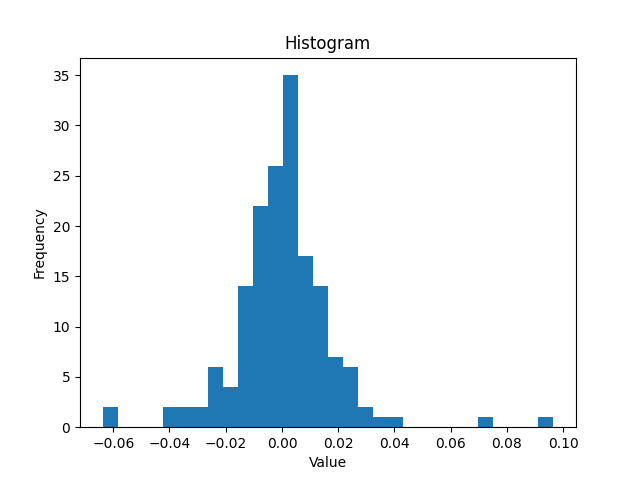

For quick price analysis

[Documentation](https://omer-amin.github.io/pricepy/) | [PyPI](https://pypi.org/project/pricepy/)

## Installation

```bash
pip install pricepy
```

## Example

The following example analyses the distribution of daily returns and how they correlate with moving average crossovers.

```python
import pricepy as ppy
import yfinance as yf

dat = yf.Ticker("MSFT")
history = dat.history(period='8mo')

candles = ppy.OHLC(history)

sma10 = ppy.sma(candles.closes, 10)
sma5 = ppy.sma(candles.closes, 5)

# Candlestick chart
ppy.candlestick(candles, overlays=[sma5, sma10])

# Daily returns distribution
daily_returns = ppy.logReturns(candles.closes)
ppy.hist(daily_returns, bins=30)
```

### Outputs:

| Candlestick + SMAs               | Daily returns histogram        |
|:--------------------------------:|:------------------------------:|
|  |  |
