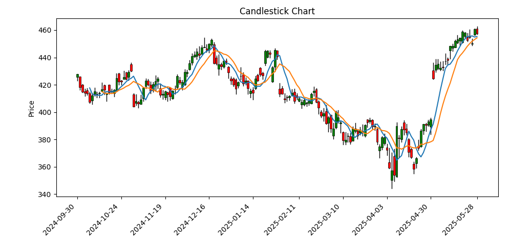
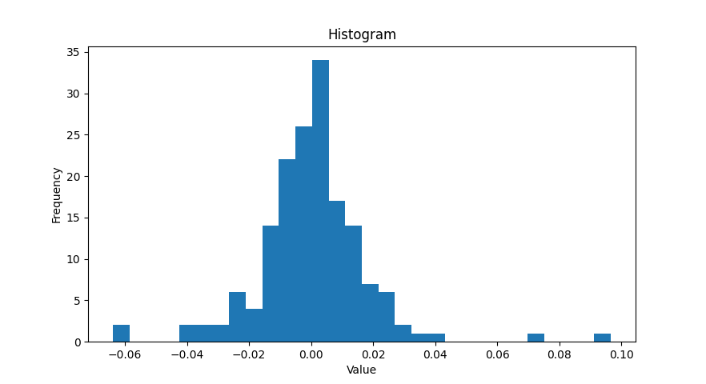

Pricepy makes price analysis very quick and easy. Suitable for Python beginners.

[Documentation](https://omer-amin.github.io/pricepy/) | [PyPI](https://pypi.org/project/pricepy/)

## Installation

```bash
pip install pricepy
```

## Example

The following example pulls data using `yfinance` and plots a candlestick chart overlayed with 5 and 10-day simple moving averages. It also visualizes the distribution of daily returns:

```python
import pricepy as ppy
import yfinance as yf

dat = yf.Ticker("MSFT")
history = dat.history(period='8mo')

candles = ppy.OHLC(history)

sma10 = ppy.sma(candles.closes, 10)
sma5 = ppy.sma(candles.closes, 5)

# Candlestick chart
ppy.candlestick(candles, overlays=[sma5, sma10])

# Daily returns distribution
daily_returns = ppy.logReturns(candles.closes)
ppy.hist(daily_returns, bins=30)
```

Outputs:




