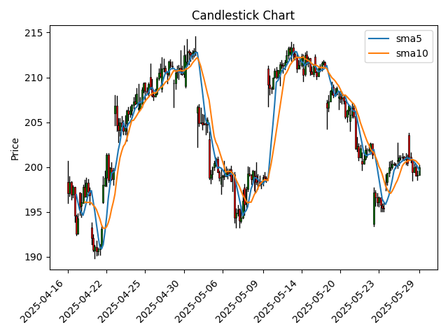
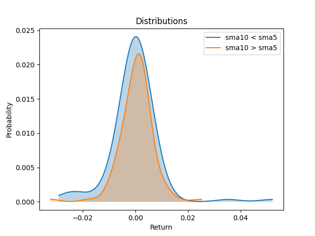

For quick price analysis using statistically robust methods.

[Documentation](https://omer-amin.github.io/pricepy/) | [PyPI](https://pypi.org/project/pricepy/)

## Installation

```bash
pip install pricepy
```

## Example

The following example analyses how moving average crossovers correlate with the distribution of daily returns.

```python
import pricepy as ppy
import yfinance as yf

# Fetch data with yfinance
dat     = yf.Ticker("AAPL")
history = dat.history(period="30d", interval="1h")

# Extract candle data
candles = ppy.OHLC(history)
closes  = candles.closes
returns = ppy.logReturns(candles.closes)

# Compute moving averages
sma10 = ppy.sma(closes, 10)
sma5  = ppy.sma(closes, 5)

# Split candlestick data by condition
condition = ppy.Condition(sma10, '<', sma5)
pos, neg  = ppy.split(returns, condition)

# Compute distributions
xp, yp = ppy.distribution(pos)
xn, yn = ppy.distribution(neg)

# Plot distributions
ppy.multiplot([
    ('sma10 < sma5', 'mountain', xp, yp),
    ('sma10 > sma5', 'mountain', xn, yn)
], disp=ppy.Display(xlabel="Return", ylabel="Probability", title="Distributions"))

# Plot candles
ppy.candlestick(candles, overlays=[sma5, sma10], labels=['sma5', 'sma10'])
```

### Outputs:

| Candlestick + SMAs               | Distributions                  |
|:--------------------------------:|:------------------------------:|
|  |  |

The distributions show that, on average, historical daily returns are more bearish when the 10-day moving average is less than the 5-day moving average.
